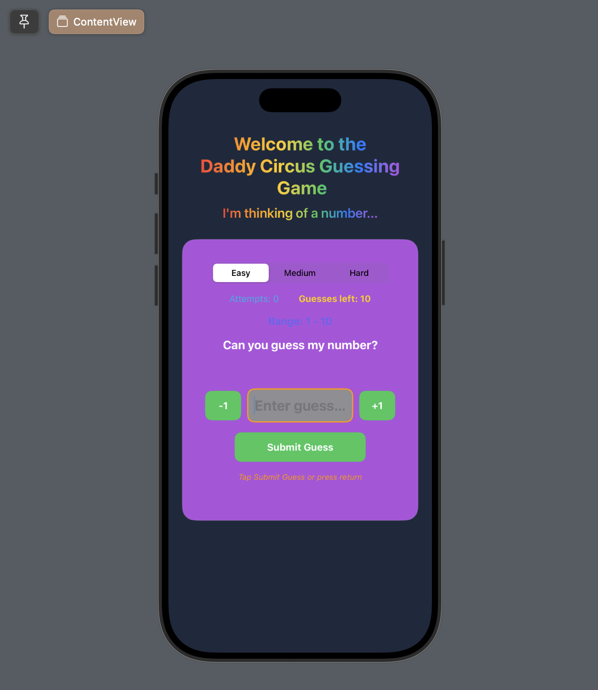

# HiLow - Number Guessing Game

A fun number guessing game built in both **JavaFX** (desktop) and **SwiftUI** (iOS/iPadOS).

---



## How to Play

1. Select a difficulty level — Easy, Medium, or Hard
2. Type a number into the guess field, or use the **-1** and **+1** buttons to adjust your guess
3. Press **Submit Guess** or hit **Return** to submit
4. Follow the arrow and feedback to narrow down the secret number
5. Guess correctly before you run out of tries!

---

## Difficulty Levels

| Level  | Range    | Max Guesses |
|--------|----------|-------------|
| Easy   | 1 – 10   | 10          |
| Medium | 1 – 100  | 7           |
| Hard   | 1 – 1000 | 5           |

---

## Features

- 🎯 Random number generation each round
- ⬆⬇ Arrow indicators for too high / too low
- ⚠️ Guesses remaining counter with color warnings
- 🔄 Play Again without leaving the app
- 🌈 Rainbow gradient title
- 📳 Shake animation on invalid input

---

## Versions

### JavaFX (Desktop)
- **File:** `HiLow.java`
- **Package:** `hilowgame`
- **Requirements:** Java 21+, JavaFX SDK 21+
- **Run with Maven:** `mvn javafx:run`
- **Run manually:**
```bash
javac --module-path /path/to/javafx-sdk/lib --add-modules javafx.controls HiLow.java
java  --module-path /path/to/javafx-sdk/lib --add-modules javafx.controls HiLow
```

### SwiftUI (iOS / iPadOS)
- **File:** `ContentView.swift`
- **Requirements:** Xcode 16+, iOS 17+
- **Run:** Open the project in Xcode and press Play to launch in the simulator

---

## Project Structure

```
HiLow/
├── JavaFX/
│   └── src/hilowgame/HiLow.java
└── SwiftUI/
    └── HiLow/ContentView.swift
```

---

## Authors

Ing-Ram (Chad Ingram) Java 211 — Spring 2026

